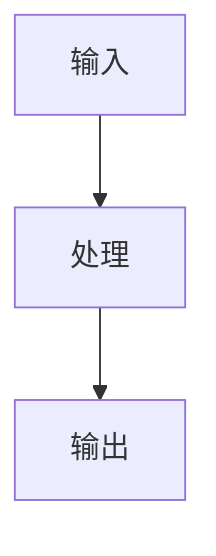

# 📚 开源项目 PocketFlow 深度学习笔记

> 版本：v1.0
> 日期：2025-11-27
> 项目地址：https://github.com/the-pocket/PocketFlow

---

## 一、项目概述

### 1.1 项目来源

PocketFlow 是 GitHub 上非常火的一个开源项目（已有 1.6k+ stars），由 The Pocket 组织开发维护。

- **GitHub**：https://github.com/the-pocket/PocketFlow
- **官方文档**：https://the-pocket.github.io/PocketFlow/
- **Discord 社区**：https://discord.gg/hUHHE9Sa6T

### 1.2 核心宣传点

**一个仅有 100 行代码的极简 LLM 框架**，用于构建智能体（Agents）、工作流（Workflow）、RAG 等 LLM 应用。

> ⚠️ **实际验证**：核心文件 `pocketflow/__init__.py` 实际为 **99 行代码**（不含空行）

### 1.3 设计理念

#### 为什么只有 100 行？

对比主流 LLM 框架的代码量：

| 框架 | 代码行数 | 安装大小 | 抽象层次 | 依赖 |
|------|---------|---------|---------|------|
| **LangChain** | 405K | +166MB | Agent, Chain | 大量第三方依赖 |
| **CrewAI** | 18K | +173MB | Agent, Chain | 大量第三方依赖 |
| **LangGraph** | 37K | +51MB | Agent, Graph | 中等依赖 |
| **AutoGen** | 7K (核心) | +26MB | Agent | 可选依赖 |
| **PocketFlow** | **100** | **+56KB** | **Graph** | **零依赖** |

#### 核心优势

1. **零依赖**：只依赖 Python 标准库（asyncio, warnings, copy, time）
2. **零供应商锁定**：不绑定任何 LLM 提供商（OpenAI/Claude/Gemini）
3. **极致简洁**：核心抽象只有 Graph，没有其他概念
4. **完全可控**：100 行代码可以完全理解和掌控

---

## 二、核心架构

### 2.1 核心抽象：Graph + Shared Store

PocketFlow 将 LLM 工作流抽象为一个**有向图（Graph）**：

```
节点 (Node) ──[Action]──> 节点 (Node) ──[Action]──> 节点 (Node)
                ↓                          ↓
            Shared Store (共享数据存储)
```

**两个关键组成部分**：

1. **Graph**：节点和边的集合
   - **Node**：执行具体任务的节点
   - **Flow**：通过 Actions（有向边）连接节点

2. **Shared Store**：所有节点共享的数据存储
   - 通常是一个 Python 字典
   - 节点通过它读写数据

### 2.2 类层次结构

```
BaseNode (基类)
├── Node (带重试机制)
│   ├── BatchNode (批处理)
│   └── AsyncNode (异步)
│       ├── AsyncBatchNode (异步批处理)
│       └── AsyncParallelBatchNode (异步并行批处理)
└── Flow (流程编排)
    ├── BatchFlow (批量流程)
    └── AsyncFlow (异步流程)
        ├── AsyncBatchFlow (异步批量流程)
        └── AsyncParallelBatchFlow (异步并行批量流程)
```

### 2.3 核心代码分析

#### 2.3.1 BaseNode - 最基础的抽象（第3-20行）

```python
class BaseNode:
    def __init__(self):
        self.params, self.successors = {}, {}

    def prep(self, shared): pass      # 准备数据
    def exec(self, prep_res): pass    # 执行计算
    def post(self, shared, prep_res, exec_res): pass  # 后处理

    def _run(self, shared):
        p = self.prep(shared)         # 第一步：准备
        e = self._exec(p)             # 第二步：执行
        return self.post(shared, p, e)  # 第三步：后处理
```

**关键设计**：
- **三步执行模型**：`prep -> exec -> post`
- **successors 字典**：存储后继节点，key 是 action 名称
- **params 字典**：存储节点参数

#### 2.3.2 运算符重载 - 优雅的语法糖（第17-24行）

```python
# __rshift__ 实现 >> 运算符（默认转换）
def __rshift__(self, other):
    return self.next(other)

# __sub__ 实现 - 运算符（条件转换）
def __sub__(self, action):
    return _ConditionalTransition(self, action)
```

**使用效果**：
```python
# 默认转换（post 返回 None 或 "default"）
node_a >> node_b

# 条件转换（post 返回特定 action）
node_a - "success" >> node_b
node_a - "failure" >> node_c
```

#### 2.3.3 Node - 带重试机制（第26-34行）

```python
class Node(BaseNode):
    def __init__(self, max_retries=1, wait=0):
        super().__init__()
        self.max_retries = max_retries  # 最大重试次数
        self.wait = wait                # 重试等待时间（秒）

    def _exec(self, prep_res):
        for self.cur_retry in range(self.max_retries):
            try:
                return self.exec(prep_res)
            except Exception as e:
                if self.cur_retry == self.max_retries - 1:
                    return self.exec_fallback(prep_res, e)
                if self.wait > 0:
                    time.sleep(self.wait)
```

**核心特性**：
- 自动重试机制
- 失败后的 fallback 处理
- 可配置的等待时间（用于处理 API 限流）

#### 2.3.4 BatchNode - 批处理（第36-37行）

```python
class BatchNode(Node):
    def _exec(self, items):
        return [super(BatchNode, self)._exec(i) for i in (items or [])]
```

**工作原理**：
- `prep()` 返回一个**可迭代对象**（列表/生成器）
- `exec(item)` 对**每个元素**执行一次
- `post()` 接收**所有结果的列表** `exec_res_list`

#### 2.3.5 Flow - 流程编排（第39-51行）

```python
class Flow(BaseNode):
    def __init__(self, start=None):
        super().__init__()
        self.start_node = start

    def _orch(self, shared, params=None):
        curr = copy.copy(self.start_node)
        p = params or {**self.params}
        last_action = None

        # 核心编排循环
        while curr:
            curr.set_params(p)
            last_action = curr._run(shared)
            curr = copy.copy(self.get_next_node(curr, last_action))

        return last_action
```

**编排逻辑**：
1. 从 `start_node` 开始
2. 运行当前节点，获取返回的 `action`
3. 根据 `action` 找到下一个节点（通过 `successors` 字典）
4. 重复直到没有后继节点

**关键细节**：
- 使用 `copy.copy()` 复制节点，避免状态污染
- `get_next_node()` 查找 `successors[action]`，找不到时发出警告

#### 2.3.6 异步支持（第59-100行）

完整支持异步编程：
- **AsyncNode**：异步版本的 Node
- **AsyncBatchNode**：异步批处理（顺序）
- **AsyncParallelBatchNode**：异步并行批处理
- **AsyncFlow**：异步流程编排

**关键区别**：
```python
# 同步节点
class MyNode(Node):
    def exec(self, data):
        return call_llm(data)

# 异步节点
class MyAsyncNode(AsyncNode):
    async def exec_async(self, data):
        return await call_llm_async(data)
```

---

## 三、核心概念详解

### 3.1 Node 的三步执行模型

每个 Node 都遵循 **prep → exec → post** 三步：

```python
class SummarizeFile(Node):
    def prep(self, shared):
        """第一步：读取和预处理数据"""
        # 从 shared store 读取文件内容
        return shared["file_content"]

    def exec(self, file_content):
        """第二步：执行核心计算逻辑"""
        # 调用 LLM 进行摘要
        # ⚠️ 不要在这里访问 shared
        # ⚠️ 不要捕获异常（让 Node 的重试机制处理）
        prompt = f"Summarize: {file_content}"
        return call_llm(prompt)

    def post(self, shared, prep_res, exec_res):
        """第三步：后处理和写入结果"""
        # 将结果写回 shared store
        shared["summary"] = exec_res

        # 返回 action 决定下一个节点
        return "default"  # 或返回 None（默认）
```

**设计原则**：

1. **prep**：只负责读取数据
   - 从 `shared` 读取
   - 预处理、序列化
   - 返回给 `exec` 使用

2. **exec**：只负责计算
   - **不访问** `shared`
   - **不捕获异常**（让重试机制处理）
   - 保持幂等性（可重试）
   - 通常是 LLM 调用

3. **post**：只负责写入
   - 将结果写回 `shared`
   - 返回 `action` 决定流程走向
   - 可以有副作用（打印、记录日志）

**为什么要分三步？**
- **关注点分离**：数据访问与计算逻辑分离
- **可测试性**：每个步骤可以单独测试
- **重试友好**：只有 `exec` 会重试，避免重复读写

### 3.2 Flow 的 Action 机制

Flow 通过 **Action**（字符串）来决定节点之间的转换：

#### 3.2.1 默认转换

```python
# 语法：node_a >> node_b
# 等价于：node_a - "default" >> node_b

node_a >> node_b >> node_c

class NodeA(Node):
    def post(self, shared, prep_res, exec_res):
        return None  # 或不写 return，默认是 "default"
```

#### 3.2.2 条件转换

```python
# 根据 post 返回值选择不同路径
check_node - "positive" >> positive_handler
check_node - "negative" >> negative_handler

class CheckNode(Node):
    def post(self, shared, prep_res, exec_res):
        if exec_res > 0:
            return "positive"  # 跳转到 positive_handler
        else:
            return "negative"  # 跳转到 negative_handler
```

#### 3.2.3 循环和分支

```python
# 创建循环
retry_node - "retry" >> retry_node       # 失败时重试
retry_node - "success" >> next_node      # 成功时继续

# 复杂分支
review - "approved" >> payment
review - "rejected" >> finish
review - "needs_revision" >> revise
revise >> review  # 修改后重新审核
```

**完整示例 - 费用审批流程**：

```python
# 定义节点
review = ReviewExpense()
payment = ProcessPayment()
revise = ReviseExpense()
finish = FinishProcess()

# 定义转换
review - "approved" >> payment        # 批准 → 付款
review - "rejected" >> finish         # 拒绝 → 结束
review - "needs_revision" >> revise   # 需修改 → 修改
revise >> review                      # 修改后 → 重新审核
payment >> finish                     # 付款后 → 结束

# 创建流程
flow = Flow(start=review)

# 运行
shared = {"expense_data": {...}}
flow.run(shared)
```

### 3.3 通信方式：Shared Store vs Params

#### 3.3.1 Shared Store（主要方式）

**定义**：全局共享的数据存储，通常是字典

**特点**：
- 所有节点都能访问
- 通过 `prep()` 读取
- 通过 `post()` 写入
- 适用于几乎所有场景

**示例**：
```python
shared = {
    "user_input": "原始输入",
    "processed_data": None,
    "result": None
}

class ProcessNode(Node):
    def prep(self, shared):
        return shared["user_input"]  # 读取

    def post(self, shared, prep_res, exec_res):
        shared["result"] = exec_res  # 写入
```

#### 3.3.2 Params（仅用于 Batch）

**定义**：每个节点的局部参数，由父 Flow 传递

**特点**：
- 不可变（执行期间不改变）
- 用于标识任务（如文件名、ID）
- 主要在 BatchFlow 中使用

**示例**：
```python
class ProcessFile(Node):
    def prep(self, shared):
        filename = self.params["filename"]  # 读取参数
        return shared["files"][filename]

    def post(self, shared, prep_res, exec_res):
        filename = self.params["filename"]
        shared["results"][filename] = exec_res

# BatchFlow 会为每个文件设置不同的 params
class ProcessAllFiles(BatchFlow):
    def prep(self, shared):
        return [{"filename": f} for f in shared["files"].keys()]
```

### 3.4 批处理模式

#### 3.4.1 BatchNode - 批量处理数据

**使用场景**：对多个数据项执行相同操作

```python
class SummarizeFiles(BatchNode):
    def prep(self, shared):
        # 返回可迭代对象（列表、生成器等）
        return shared["files"]  # ["file1.txt", "file2.txt", ...]

    def exec(self, file):
        # 对每个元素执行一次
        content = read_file(file)
        return summarize(content)

    def post(self, shared, prep_res, exec_res_list):
        # exec_res_list 是所有结果的列表
        shared["summaries"] = exec_res_list
        print(f"处理了 {len(exec_res_list)} 个文件")
```

**执行流程**：
```
prep() → ["file1", "file2", "file3"]
         ↓
exec("file1") → summary1
exec("file2") → summary2
exec("file3") → summary3
         ↓
post() ← [summary1, summary2, summary3]
```

#### 3.4.2 BatchFlow - 多次运行流程

**使用场景**：用不同参数多次运行同一个流程

```python
class ProcessEachFile(BatchFlow):
    def prep(self, shared):
        # 返回参数字典列表
        files = shared["files"]
        return [{"filename": f} for f in files]

# 假设有一个处理单个文件的流程
single_file_flow = Flow(start=ReadFile())

# 用 BatchFlow 包装，对每个文件运行一次
batch_flow = ProcessEachFile(start=single_file_flow)
batch_flow.run(shared)
```

**执行流程**：
```
prep() → [{"filename": "f1"}, {"filename": "f2"}]
         ↓
对每个参数字典：
  1. 合并到节点的 params
  2. 运行内部流程
  3. 处理下一个
```

#### 3.4.3 实际案例 - 文章写作工作流

来自 `cookbook/pocketflow-workflow/nodes.py`：

```python
class WriteSimpleContent(BatchNode):
    """批量写作文章的各个章节"""

    def prep(self, shared):
        # 返回所有章节标题
        return shared.get("sections", [])

    def exec(self, section):
        # 为每个章节生成内容
        prompt = f"Write a paragraph about: {section}"
        content = call_llm(prompt)

        # 显示进度
        print(f"✓ Completed section: {section}")

        return section, content

    def post(self, shared, prep_res, exec_res_list):
        # exec_res_list = [(section1, content1), (section2, content2), ...]

        section_contents = {}
        for section, content in exec_res_list:
            section_contents[section] = content

        # 合并成完整文章草稿
        draft = "\n\n".join([
            f"## {section}\n\n{content}"
            for section, content in section_contents.items()
        ])

        shared["draft"] = draft
        return "default"
```

### 3.5 异步和并行

#### 3.5.1 AsyncNode - 异步节点

```python
class AsyncSummary(AsyncNode):
    async def prep_async(self, shared):
        # 异步读取文件
        content = await read_file_async(shared["filepath"])
        return content

    async def exec_async(self, content):
        # 异步调用 LLM
        return await call_llm_async(f"Summarize: {content}")

    async def post_async(self, shared, prep_res, exec_res):
        shared["summary"] = exec_res
        return "default"

# 必须用 AsyncFlow 包装
flow = AsyncFlow(start=AsyncSummary())

# 必须用 await 运行
await flow.run_async(shared)
```

#### 3.5.2 AsyncParallelBatchNode - 并行批处理

```python
class ParallelSummaries(AsyncParallelBatchNode):
    async def prep_async(self, shared):
        return shared["files"]  # ["f1", "f2", "f3"]

    async def exec_async(self, file):
        # 每个文件的处理会并行执行
        content = await read_file_async(file)
        return await call_llm_async(f"Summarize: {content}")

    async def post_async(self, shared, prep_res, exec_res_list):
        shared["summaries"] = exec_res_list
```

**性能对比**：
- **BatchNode**：顺序执行，总时间 = N × 单次时间
- **AsyncBatchNode**：顺序异步，总时间 = N × 单次时间
- **AsyncParallelBatchNode**：并行执行，总时间 ≈ 单次时间

**注意事项**：
- 并行调用可能触发 API 限流
- 确保任务之间没有依赖关系
- Python GIL 限制，只适合 I/O 密集型任务

---

## 四、设计模式实践

### 4.1 Workflow（工作流）- 任务分解

**适用场景**：将复杂任务分解为多个步骤

**实际案例**：文章写作（`cookbook/pocketflow-workflow/`）

```python
# 节点定义
class GenerateOutline(Node):
    """生成文章大纲"""
    def exec(self, topic):
        return call_llm(f"Create outline for: {topic}")

class WriteContent(BatchNode):
    """为每个章节写内容"""
    def prep(self, shared):
        return shared["sections"]

    def exec(self, section):
        return call_llm(f"Write about: {section}")

class ApplyStyle(Node):
    """应用写作风格"""
    def exec(self, draft):
        return call_llm(f"Make conversational: {draft}")

# 流程定义
outline >> write >> style
flow = Flow(start=outline)
```

**执行流程**：
```
输入主题 → 生成大纲 → 批量写作各章节 → 应用风格 → 完成文章
```

### 4.2 Agent（智能体）- 动态决策

**适用场景**：根据上下文动态选择行动

**核心思想**：
1. **Context**：提供当前状态和历史
2. **Action Space**：定义可执行的动作
3. **Decision**：LLM 根据上下文选择动作

**示例代码**：
```python
class DecideAction(Node):
    """决策节点：选择搜索或回答"""

    def prep(self, shared):
        context = shared.get("search_results", "无搜索结果")
        query = shared["query"]
        return query, context

    def exec(self, inputs):
        query, context = inputs

        prompt = f"""
        任务：{query}
        已有信息：{context}

        选择行动：
        1. search - 搜索更多信息
        2. answer - 根据现有信息回答

        输出 YAML：
        ```yaml
        action: search/answer
        reason: 原因
        search_term: 搜索词（如果选 search）
        ```
        """

        response = call_llm(prompt)
        result = yaml.safe_load(response)
        return result

    def post(self, shared, prep_res, exec_res):
        if exec_res["action"] == "search":
            shared["search_term"] = exec_res["search_term"]
        return exec_res["action"]  # 返回 "search" 或 "answer"

class SearchWeb(Node):
    """搜索节点"""
    def exec(self, search_term):
        return web_search(search_term)

    def post(self, shared, prep_res, exec_res):
        # 添加到搜索历史
        prev = shared.get("search_results", [])
        shared["search_results"] = prev + [exec_res]
        return "decide"  # 回到决策节点

class DirectAnswer(Node):
    """回答节点"""
    def exec(self, inputs):
        query, context = inputs
        return call_llm(f"Context: {context}\nAnswer: {query}")

# 构建 Agent 流程
decide = DecideAction()
search = SearchWeb()
answer = DirectAnswer()

decide - "search" >> search
decide - "answer" >> answer
search - "decide" >> decide  # 搜索后回到决策（循环）

agent_flow = Flow(start=decide)
```

**执行流程**：
```
决策 → 搜索 → 决策 → 搜索 → 决策 → 回答
  ↑______________|           ↑______________|
      (循环搜索)                 (收集足够信息后回答)
```

### 4.3 RAG（检索增强生成）

**适用场景**：需要从知识库检索信息来回答问题

**两阶段设计**：
1. **离线阶段**：构建索引
2. **在线阶段**：检索 + 生成

**示例代码**：
```python
# === 离线阶段：构建索引 ===

class ChunkDocs(BatchNode):
    """将文档切分成小块"""
    def prep(self, shared):
        return shared["documents"]  # 文档列表

    def exec(self, doc):
        return chunk_text(doc, size=500)  # 切分成 500 字符

    def post(self, shared, prep_res, exec_res_list):
        # 扁平化所有 chunks
        all_chunks = []
        for chunks in exec_res_list:
            all_chunks.extend(chunks)
        shared["chunks"] = all_chunks

class EmbedChunks(BatchNode):
    """为每个 chunk 生成向量"""
    def prep(self, shared):
        return shared["chunks"]

    def exec(self, chunk):
        return get_embedding(chunk)  # 调用 embedding API

    def post(self, shared, prep_res, exec_res_list):
        shared["embeddings"] = exec_res_list

class BuildIndex(Node):
    """构建向量索引"""
    def exec(self, data):
        chunks, embeddings = data
        index = create_faiss_index(embeddings)
        return index

    def post(self, shared, prep_res, exec_res):
        shared["index"] = exec_res

# 离线流程
chunk >> embed >> build_index
offline_flow = Flow(start=chunk)

# === 在线阶段：检索 + 生成 ===

class EmbedQuery(Node):
    """将用户问题转为向量"""
    def exec(self, query):
        return get_embedding(query)

class RetrieveDocs(Node):
    """检索最相关的文档"""
    def prep(self, shared):
        query_emb = shared["query_embedding"]
        index = shared["index"]
        chunks = shared["chunks"]
        return query_emb, index, chunks

    def exec(self, inputs):
        query_emb, index, chunks = inputs
        # 搜索最相似的 3 个 chunks
        distances, indices = index.search(query_emb, k=3)
        retrieved = [chunks[i] for i in indices[0]]
        return retrieved

class GenerateAnswer(Node):
    """基于检索结果生成答案"""
    def prep(self, shared):
        query = shared["query"]
        context = "\n".join(shared["retrieved_docs"])
        return query, context

    def exec(self, inputs):
        query, context = inputs
        prompt = f"Context:\n{context}\n\nQuestion: {query}\nAnswer:"
        return call_llm(prompt)

# 在线流程
embed_query >> retrieve >> generate
online_flow = Flow(start=embed_query)
```

### 4.4 Map-Reduce

**适用场景**：大规模数据处理

**核心思想**：
- **Map**：并行处理每个数据项
- **Reduce**：合并所有结果

**示例**：批量文件摘要
```python
class MapSummaries(BatchNode):
    """Map 阶段：摘要每个文件"""
    def prep(self, shared):
        return list(shared["files"].items())

    def exec(self, file_item):
        filename, content = file_item
        summary = call_llm(f"Summarize: {content}")
        return filename, summary

    def post(self, shared, prep_res, exec_res_list):
        shared["file_summaries"] = dict(exec_res_list)

class ReduceSummaries(Node):
    """Reduce 阶段：合并所有摘要"""
    def prep(self, shared):
        return shared["file_summaries"]

    def exec(self, summaries):
        combined = "\n".join([
            f"{file}: {summary}"
            for file, summary in summaries.items()
        ])
        return call_llm(f"Combine summaries:\n{combined}")

    def post(self, shared, prep_res, exec_res):
        shared["final_summary"] = exec_res

# Map-Reduce 流程
map_node >> reduce_node
flow = Flow(start=map_node)
```

---

## 五、实战技巧

### 5.1 错误处理策略

#### 策略 1：利用 Node 的重试机制

```python
class RobustLLMCall(Node):
    def exec(self, prompt):
        result = call_llm(prompt)

        # 验证结果
        if not is_valid_json(result):
            raise ValueError("Invalid JSON response")

        return result

# 配置重试
node = RobustLLMCall(
    max_retries=3,  # 最多重试 3 次
    wait=2          # 每次重试等待 2 秒
)
```

#### 策略 2：使用 fallback 优雅降级

```python
class SafeLLMCall(Node):
    def exec(self, prompt):
        return call_llm(prompt)  # 可能失败

    def exec_fallback(self, prep_res, exc):
        # 所有重试失败后的降级方案
        print(f"LLM 调用失败: {exc}")
        return "抱歉，处理失败，请稍后重试"
```

#### 策略 3：在 post 中检查并重定向

```python
class ValidatedNode(Node):
    def post(self, shared, prep_res, exec_res):
        if is_valid(exec_res):
            return "success"
        else:
            shared["error"] = exec_res
            return "error"

# 错误处理流程
validated - "success" >> next_step
validated - "error" >> error_handler
```

### 5.2 调试技巧

#### 技巧 1：添加日志节点

```python
class LogNode(Node):
    def post(self, shared, prep_res, exec_res):
        print(f"=== Shared Store ===")
        print(json.dumps(shared, indent=2))
        print("=" * 40)
```

#### 技巧 2：使用断言验证状态

```python
class CheckpointNode(Node):
    def prep(self, shared):
        # 验证前置条件
        assert "required_field" in shared
        assert shared["status"] == "ready"
        return shared["data"]
```

#### 技巧 3：可视化流程

参考 `cookbook/pocketflow-tracing/`，使用日志追踪流程执行。

### 5.3 性能优化

#### 优化 1：使用异步并行

```python
# 慢：顺序执行（10个文件 × 2秒 = 20秒）
class SlowBatch(BatchNode):
    def exec(self, file):
        return call_llm(file)  # 2秒

# 快：并行执行（约 2秒）
class FastBatch(AsyncParallelBatchNode):
    async def exec_async(self, file):
        return await call_llm_async(file)
```

#### 优化 2：减少 LLM 调用

```python
# 慢：每个项都调用 LLM
class Slow(BatchNode):
    def exec(self, item):
        return call_llm(f"Process: {item}")

# 快：批量调用 LLM
class Fast(Node):
    def exec(self, items):
        # 一次性处理多个项
        combined = "\n".join(items)
        return call_llm(f"Process all:\n{combined}")
```

#### 优化 3：缓存 LLM 结果

```python
from functools import lru_cache

@lru_cache(maxsize=1000)
def cached_llm_call(prompt):
    return call_llm(prompt)

class CachedNode(Node):
    def exec(self, prompt):
        # 相同 prompt 会从缓存返回
        return cached_llm_call(prompt)
```

### 5.4 最佳实践

#### ✅ 好的做法

```python
# 1. 节点职责单一
class GoodNode(Node):
    def prep(self, shared):
        return shared["input"]  # 只读取

    def exec(self, data):
        return process(data)    # 只计算

    def post(self, shared, prep_res, exec_res):
        shared["output"] = exec_res  # 只写入

# 2. 在 exec 中验证结果
class GoodValidation(Node):
    def exec(self, data):
        result = call_llm(data)

        # 验证，失败抛异常让重试处理
        if not validate(result):
            raise ValueError("Invalid result")

        return result

# 3. 使用 Mermaid 图规划流程
"""

"""
```

#### ❌ 避免的做法

```python
# 1. 在 exec 中访问 shared（破坏关注点分离）
class Bad1(Node):
    def exec(self, data):
        return self.shared["data"]  # ❌ 错误

# 2. 在工具函数中捕获异常（阻止重试）
def bad_llm_call(prompt):
    try:  # ❌ 错误
        return call_llm(prompt)
    except:
        return "error"

# 3. 在 BatchNode 的 post 中误用 exec_res（应该是 exec_res_list）
class Bad3(BatchNode):
    def post(self, shared, prep_res, exec_res):
        shared["result"] = exec_res  # ❌ 错误，应该是 exec_res_list
```

---

## 六、项目结构分析

### 6.1 目录结构

```
PocketFlow/
├── pocketflow/
│   └── __init__.py          # 核心框架（99行）
├── tests/                   # 单元测试（10个测试文件）
│   ├── test_flow_basic.py
│   ├── test_batch_node.py
│   ├── test_async_flow.py
│   └── ...
├── cookbook/                # 示例应用（47个！）
│   ├── pocketflow-workflow/
│   ├── pocketflow-agent/
│   ├── pocketflow-rag/
│   ├── pocketflow-batch/
│   └── ...
├── docs/                    # 文档网站源码
├── utils/                   # 工具函数示例
├── setup.py                 # 安装配置
├── README.md
└── LICENSE (MIT)
```

### 6.2 Cookbook 示例分类

#### 基础示例（☆☆☆ Dummy）

| 示例 | 功能 | 设计模式 |
|------|------|---------|
| Chat | 基础聊天机器人 | Workflow |
| Structured Output | 提取结构化数据 | Workflow |
| Workflow | 文章写作流程 | Workflow |
| Agent | 搜索智能体 | Agent |
| RAG | 检索增强生成 | RAG |
| Batch | 批量翻译 | Map-Reduce |

#### 中级示例（★☆☆ Beginner）

| 示例 | 功能 | 亮点 |
|------|------|------|
| Multi-Agent | 多智能体游戏 | 异步通信 |
| Supervisor | 监督机制 | 质量控制 |
| Parallel | 并行执行 | 性能优化 |
| Thinking | 思维链 | 复杂推理 |
| Memory | 记忆系统 | 长短期记忆 |

#### 高级示例

- Text2SQL：自然语言转 SQL
- Code Generator：代码生成器
- MCP：模型上下文协议
- Streamlit FSM：有限状态机 UI
- FastAPI WebSocket：实时聊天

### 6.3 测试覆盖

**10 个测试文件**，覆盖所有核心功能：

1. `test_flow_basic.py` - 基础流程测试（224行）
   - 节点连接
   - 条件分支
   - 循环
   - 警告处理

2. `test_batch_node.py` - 批处理测试
3. `test_async_flow.py` - 异步流程测试
4. `test_async_parallel_batch_node.py` - 异步并行测试
5. `test_fall_back.py` - 错误处理测试

**测试运行**：
```bash
# 单个测试
python -m pytest tests/test_flow_basic.py -v

# 所有测试
python -m pytest tests/ -v

# 覆盖率
python -m pytest tests/ --cov=pocketflow --cov-report=html
```

---

## 七、与其他框架对比

### 7.1 设计哲学对比

| 维度 | PocketFlow | LangChain | CrewAI | AutoGen |
|------|-----------|-----------|--------|---------|
| **抽象** | Graph | Chain + Agent | Agent | Agent |
| **哲学** | 极简，用户控制 | 大而全，开箱即用 | 面向业务 | 研究导向 |
| **学习曲线** | 陡峭但短 | 平缓但长 | 中等 | 陡峭且长 |
| **灵活性** | 极高 | 中 | 低 | 高 |
| **供应商锁定** | 无 | 有 | 有 | 可选 |

### 7.2 适用场景

**PocketFlow 适合**：
- ✅ 需要完全控制的场景
- ✅ 定制化需求多
- ✅ 对性能和大小敏感
- ✅ 学习 LLM 应用架构
- ✅ 快速原型验证

**PocketFlow 不适合**：
- ❌ 需要大量预制组件
- ❌ 团队经验不足
- ❌ 快速商业交付
- ❌ 需要企业级支持

### 7.3 迁移指南

#### 从 LangChain 迁移

```python
# LangChain
from langchain.chains import LLMChain
from langchain.prompts import PromptTemplate

chain = LLMChain(
    llm=llm,
    prompt=PromptTemplate(template="Summarize: {text}")
)
result = chain.run(text="...")

# PocketFlow
class Summarize(Node):
    def exec(self, text):
        return call_llm(f"Summarize: {text}")

node = Summarize()
shared = {"text": "..."}
node.run(shared)
```

#### 从 AutoGen 迁移

```python
# AutoGen
agent = AssistantAgent(name="assistant")
user_proxy = UserProxyAgent(name="user")
user_proxy.initiate_chat(agent, message="...")

# PocketFlow
class Assistant(Node):
    def exec(self, message):
        return call_llm(message)

class UserProxy(Node):
    def exec(self, response):
        return input("User: ")

# 对话循环
assistant >> user_proxy >> assistant
flow = Flow(start=assistant)
```

---

## 八、进阶主题

### 8.1 嵌套流程

Flow 本身也是 Node，可以嵌套：

```python
# 子流程
sub_flow = Flow(start=node_a)
node_a >> node_b

# 父流程
parent_flow = Flow(start=sub_flow)
sub_flow >> node_c

# 运行父流程会执行：node_a → node_b → node_c
```

### 8.2 动态流程构建

根据数据动态构建流程：

```python
def create_dynamic_flow(config):
    nodes = []
    for step in config["steps"]:
        if step["type"] == "llm":
            nodes.append(LLMNode())
        elif step["type"] == "search":
            nodes.append(SearchNode())

    # 串联所有节点
    for i in range(len(nodes) - 1):
        nodes[i] >> nodes[i + 1]

    return Flow(start=nodes[0])
```

### 8.3 流程可视化

参考 `cookbook/pocketflow-tracing/`：

```python
# 记录流程执行轨迹
traces = []

class TracedNode(Node):
    def _run(self, shared):
        traces.append({
            "node": self.__class__.__name__,
            "timestamp": time.time()
        })
        return super()._run(shared)

# 生成 Mermaid 图
def generate_mermaid(traces):
    lines = ["flowchart TD"]
    for i in range(len(traces) - 1):
        lines.append(f"    {traces[i]['node']} --> {traces[i+1]['node']}")
    return "\n".join(lines)
```

### 8.4 人在回路（Human-in-the-Loop）

参考 `cookbook/pocketflow-cli-hitl/`：

```python
class HumanReview(Node):
    def exec(self, draft):
        print("草稿：", draft)
        feedback = input("请审核（approve/reject）: ")
        return feedback

    def post(self, shared, prep_res, exec_res):
        if exec_res == "approve":
            return "approved"
        else:
            return "rejected"

# 流程
generate >> review >> finalize
review - "approved" >> finalize
review - "rejected" >> regenerate
regenerate >> review
```

---

## 九、常见问题

### Q1: 为什么 exec 不能访问 shared？

**A**: 为了强制分离关注点：
- `prep` 负责数据访问（读）
- `exec` 负责纯计算（无副作用）
- `post` 负责数据写入（写）

这样设计的好处：
- ✅ 更容易测试（exec 是纯函数）
- ✅ 更容易复用（exec 不依赖外部状态）
- ✅ 更容易并行（exec 无副作用）

### Q2: 什么时候用 Node，什么时候用 BatchNode？

**A**:
- **Node**：处理单个数据项
- **BatchNode**：处理多个数据项，且每个项的处理逻辑相同

**判断标准**：
- `prep()` 返回列表吗？→ 用 BatchNode
- `exec()` 需要对每个元素执行吗？→ 用 BatchNode
- 否则用 Node

### Q3: 如何处理 LLM 的限流错误？

**A**: 使用 Node 的重试机制：

```python
node = MyNode(
    max_retries=5,  # 重试 5 次
    wait=10         # 每次等待 10 秒
)
```

或在 fallback 中处理：

```python
def exec_fallback(self, prep_res, exc):
    if "rate limit" in str(exc):
        time.sleep(60)  # 等待 1 分钟
        return self.exec(prep_res)  # 重试
    raise exc
```

### Q4: 如何在流程中间暂停等待用户输入？

**A**: 使用 AsyncNode 和 post_async：

```python
class WaitForUser(AsyncNode):
    async def post_async(self, shared, prep_res, exec_res):
        # 异步等待用户输入
        feedback = await get_user_input_async()
        shared["feedback"] = feedback
        return "continue"
```

### Q5: 100 行代码真的够用吗？

**A**: 是的！100 行提供的是**核心抽象**，具体功能由你实现：
- LLM 调用 → 你自己写（10 行）
- 工具函数 → 你自己写（根据需求）
- 业务逻辑 → 在 Node 的 prep/exec/post 中实现

这正是 PocketFlow 的哲学：**提供框架，不限制实现**

---

## 十、学习路径建议

### 第一阶段：理解核心（1-2 天）

1. ✅ 阅读 `pocketflow/__init__.py`（99 行）
2. ✅ 运行 `tests/test_flow_basic.py`
3. ✅ 理解三步执行模型（prep-exec-post）
4. ✅ 理解 Action 机制（>> 和 -）

### 第二阶段：运行示例（2-3 天）

1. ✅ 运行 `cookbook/pocketflow-workflow/`
2. ✅ 运行 `cookbook/pocketflow-agent/`
3. ✅ 运行 `cookbook/pocketflow-batch/`
4. ✅ 修改示例，理解每个节点的作用

### 第三阶段：创建项目（1 周）

1. ✅ 从简单项目开始（如聊天机器人）
2. ✅ 编写 `docs/design.md`（流程图、节点设计）
3. ✅ 实现节点（nodes.py）
4. ✅ 连接流程（flow.py）
5. ✅ 测试和优化

### 第四阶段：深入掌握（持续）

1. ✅ 学习高级示例（Multi-Agent、Parallel 等）
2. ✅ 尝试不同设计模式
3. ✅ 贡献代码或示例到社区
4. ✅ 阅读源码，理解实现细节

---

## 十一、参考资源

### 官方资源

- **GitHub**：https://github.com/the-pocket/PocketFlow
- **文档**：https://the-pocket.github.io/PocketFlow/
- **Discord**：https://discord.gg/hUHHE9Sa6T
- **YouTube**：https://www.youtube.com/@ZacharyLLM

### 推荐阅读

1. **Agentic Coding** 文章：https://zacharyhuang.substack.com/p/agentic-coding-the-most-fun-way-to
2. **设计模式文档**：
   - Agent：docs/design_pattern/agent.md
   - Workflow：docs/design_pattern/workflow.md
   - RAG：docs/design_pattern/rag.md
3. **核心抽象文档**：
   - Node：docs/core_abstraction/node.md
   - Flow：docs/core_abstraction/flow.md
   - Batch：docs/core_abstraction/batch.md

### 本地资源

- **核心代码**：`pocketflow/__init__.py`（99 行，必读！）
- **测试代码**：`tests/`（10 个文件）
- **示例代码**：`cookbook/`（47 个示例）
- **Claude Code 指南**：`CLAUDE.md`（中文完整指南）

---

## 十二、总结

### 核心要点

1. **100 行代码**实现完整的 LLM 框架
2. **零依赖**，完全可控
3. **Graph 抽象**：Node + Flow + Shared Store
4. **三步执行**：prep → exec → post
5. **Action 驱动**：>> 和 - 运算符
6. **设计模式**：Workflow、Agent、RAG、Map-Reduce

### 关键优势

- ✅ 学习成本低（代码少，概念清晰）
- ✅ 灵活性极高（完全控制）
- ✅ 性能优秀（无多余抽象）
- ✅ 零供应商锁定（不绑定任何 LLM）

### 适用场景

**最适合**：
- 需要深度定制的项目
- 学习 LLM 应用架构
- 性能和大小敏感的场景
- 快速原型验证

**次适合**：
- 需要大量预制组件的项目
- 团队经验不足的场景

### 下一步行动

1. 📖 阅读核心代码（99 行）
2. 🏃 运行几个 cookbook 示例
3. 🛠️ 创建你的第一个 PocketFlow 应用
4. 🌟 Star 项目，加入社区

---

**笔记版本**：v1.0
**最后更新**：2025-11-27
**作者**：[你的名字]

---

## 附录：快速参考卡片

### 常用命令

```bash
# 安装
pip install pocketflow

# 运行测试
python -m pytest tests/test_flow_basic.py -v

# 运行示例
cd cookbook/pocketflow-workflow
python main.py
```

### 常用代码模板

```python
# 基础节点
class MyNode(Node):
    def prep(self, shared):
        return shared["input"]

    def exec(self, data):
        return process(data)

    def post(self, shared, prep_res, exec_res):
        shared["output"] = exec_res
        return "default"

# 批处理节点
class MyBatchNode(BatchNode):
    def prep(self, shared):
        return shared["items"]  # 列表

    def exec(self, item):
        return process(item)

    def post(self, shared, prep_res, exec_res_list):
        shared["results"] = exec_res_list

# 流程定义
node_a >> node_b >> node_c
flow = Flow(start=node_a)

# 运行
shared = {"input": "..."}
flow.run(shared)
```

### 设计检查清单

- [ ] 画出流程图（Mermaid）
- [ ] 设计 Shared Store 结构
- [ ] 为每个节点定义 prep/exec/post
- [ ] 确定节点类型（Node/BatchNode/AsyncNode）
- [ ] 定义 Action 转换
- [ ] 考虑错误处理（重试/fallback）
- [ ] 编写测试用例
