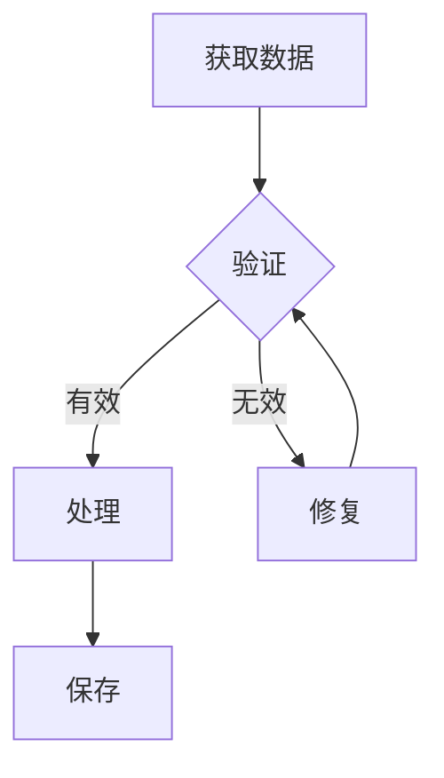

# PocketFlow 核心代码深度解析 - 终极版

> **版本**：v2.0 - 完整版
> **日期**：2025-11-27
> **作者**：学习笔记
> **项目**：https://github.com/the-pocket/PocketFlow

---

## 目录

1. [核心文件概览](#1-核心文件概览)
2. [核心概念](#2-核心概念)
3. [类结构详解](#3-类结构详解)
4. [关键机制深入](#4-关键机制深入)
5. [核心设计特点](#5-核心设计特点)
6. [实战示例](#6-实战示例)
7. [性能优化](#7-性能优化)
8. [最佳实践](#8-最佳实践)
9. [总结](#9-总结)

---

## 1. 核心文件概览

### 1.1 文件信息

PocketFlow 的核心实现在单个文件中：
- **文件路径**：`pocketflow/__init__.py`
- **代码行数**：**99 行**（不含空行）
- **依赖库**：仅 Python 标准库（`asyncio`, `warnings`, `copy`, `time`）
- **代码大小**：约 3.6 KB

### 1.2 完整源代码

```python
import asyncio, warnings, copy, time

class BaseNode:
    def __init__(self): self.params,self.successors={},{}
    def set_params(self,params): self.params=params
    def next(self,node,action="default"):
        if action in self.successors: warnings.warn(f"Overwriting successor for action '{action}'")
        self.successors[action]=node; return node
    def prep(self,shared): pass
    def exec(self,prep_res): pass
    def post(self,shared,prep_res,exec_res): pass
    def _exec(self,prep_res): return self.exec(prep_res)
    def _run(self,shared): p=self.prep(shared); e=self._exec(p); return self.post(shared,p,e)
    def run(self,shared):
        if self.successors: warnings.warn("Node won't run successors. Use Flow.")
        return self._run(shared)
    def __rshift__(self,other): return self.next(other)
    def __sub__(self,action):
        if isinstance(action,str): return _ConditionalTransition(self,action)
        raise TypeError("Action must be a string")

class _ConditionalTransition:
    def __init__(self,src,action): self.src,self.action=src,action
    def __rshift__(self,tgt): return self.src.next(tgt,self.action)

class Node(BaseNode):
    def __init__(self,max_retries=1,wait=0): super().__init__(); self.max_retries,self.wait=max_retries,wait
    def exec_fallback(self,prep_res,exc): raise exc
    def _exec(self,prep_res):
        for self.cur_retry in range(self.max_retries):
            try: return self.exec(prep_res)
            except Exception as e:
                if self.cur_retry==self.max_retries-1: return self.exec_fallback(prep_res,e)
                if self.wait>0: time.sleep(self.wait)

class BatchNode(Node):
    def _exec(self,items): return [super(BatchNode,self)._exec(i) for i in (items or [])]

class Flow(BaseNode):
    def __init__(self,start=None): super().__init__(); self.start_node=start
    def start(self,start): self.start_node=start; return start
    def get_next_node(self,curr,action):
        nxt=curr.successors.get(action or "default")
        if not nxt and curr.successors: warnings.warn(f"Flow ends: '{action}' not found in {list(curr.successors)}")
        return nxt
    def _orch(self,shared,params=None):
        curr,p,last_action =copy.copy(self.start_node),(params or {**self.params}),None
        while curr: curr.set_params(p); last_action=curr._run(shared); curr=copy.copy(self.get_next_node(curr,last_action))
        return last_action
    def _run(self,shared): p=self.prep(shared); o=self._orch(shared); return self.post(shared,p,o)
    def post(self,shared,prep_res,exec_res): return exec_res

class BatchFlow(Flow):
    def _run(self,shared):
        pr=self.prep(shared) or []
        for bp in pr: self._orch(shared,{**self.params,**bp})
        return self.post(shared,pr,None)

class AsyncNode(Node):
    async def prep_async(self,shared): pass
    async def exec_async(self,prep_res): pass
    async def exec_fallback_async(self,prep_res,exc): raise exc
    async def post_async(self,shared,prep_res,exec_res): pass
    async def _exec(self,prep_res):
        for self.cur_retry in range(self.max_retries):
            try: return await self.exec_async(prep_res)
            except Exception as e:
                if self.cur_retry==self.max_retries-1: return await self.exec_fallback_async(prep_res,e)
                if self.wait>0: await asyncio.sleep(self.wait)
    async def run_async(self,shared):
        if self.successors: warnings.warn("Node won't run successors. Use AsyncFlow.")
        return await self._run_async(shared)
    async def _run_async(self,shared): p=await self.prep_async(shared); e=await self._exec(p); return await self.post_async(shared,p,e)
    def _run(self,shared): raise RuntimeError("Use run_async.")

class AsyncBatchNode(AsyncNode,BatchNode):
    async def _exec(self,items): return [await super(AsyncBatchNode,self)._exec(i) for i in items]

class AsyncParallelBatchNode(AsyncNode,BatchNode):
    async def _exec(self,items): return await asyncio.gather(*(super(AsyncParallelBatchNode,self)._exec(i) for i in items))

class AsyncFlow(Flow,AsyncNode):
    async def _orch_async(self,shared,params=None):
        curr,p,last_action =copy.copy(self.start_node),(params or {**self.params}),None
        while curr: curr.set_params(p); last_action=await curr._run_async(shared) if isinstance(curr,AsyncNode) else curr._run(shared); curr=copy.copy(self.get_next_node(curr,last_action))
        return last_action
    async def _run_async(self,shared): p=await self.prep_async(shared); o=await self._orch_async(shared); return await self.post_async(shared,p,o)
    async def post_async(self,shared,prep_res,exec_res): return exec_res

class AsyncBatchFlow(AsyncFlow,BatchFlow):
    async def _run_async(self,shared):
        pr=await self.prep_async(shared) or []
        for bp in pr: await self._orch_async(shared,{**self.params,**bp})
        return await self.post_async(shared,pr,None)

class AsyncParallelBatchFlow(AsyncFlow,BatchFlow):
    async def _run_async(self,shared):
        pr=await self.prep_async(shared) or []
        await asyncio.gather(*(self._orch_async(shared,{**self.params,**bp}) for bp in pr))
        return await self.post_async(shared,pr,None)
```

### 1.3 代码结构概览

```
BaseNode (3-20行) ────┬──> Node (26-34行) ────┬──> BatchNode (36-37行)
                      │                        │
                      │                        └──> AsyncNode (59-74行) ────┬──> AsyncBatchNode (76-77行)
                      │                                                      │
                      │                                                      └──> AsyncParallelBatchNode (79-80行)
                      │
                      └──> Flow (39-51行) ────┬──> BatchFlow (53-57行)
                                               │
                                               └──> AsyncFlow (82-88行) ────┬──> AsyncBatchFlow (90-94行)
                                                                             │
                                                                             └──> AsyncParallelBatchFlow (96-100行)

工具类：_ConditionalTransition (22-24行) - 用于实现 node - "action" >> next_node 语法
```

---

## 2. 核心概念

### 2.1 基本架构

PocketFlow 是一个轻量级的工作流引擎框架，提供了创建和执行单个节点和复杂工作流的基础设施。

#### 四大核心组件

1. **Node（节点）**：工作流中的最小执行单元，完成具体任务
2. **Flow（流）**：将多个节点连接起来形成工作流
3. **Batch（批处理）**：处理多个数据项的特殊节点类型
4. **Async（异步）**：支持异步执行的节点和流

#### 架构图

```
┌─────────────────────────────────────────────────────────┐
│                    PocketFlow 架构                       │
├─────────────────────────────────────────────────────────┤
│                                                          │
│  Node ──[Action]──> Node ──[Action]──> Node             │
│    ↓                  ↓                  ↓               │
│  ┌──────────────────────────────────────────┐           │
│  │         Shared Store (共享存储)          │           │
│  │  { "input": ..., "output": ..., ... }    │           │
│  └──────────────────────────────────────────┘           │
│                                                          │
│  Flow: 编排和执行节点链                                  │
│  - 根据 Action 选择下一个节点                            │
│  - 管理执行流程                                          │
│                                                          │
└─────────────────────────────────────────────────────────┘
```

### 2.2 执行模型

每个节点的执行分为**三个阶段**：

```python
class Node:
    def prep(self, shared):
        """第一步：准备阶段 - 从 shared 读取和预处理数据"""
        pass

    def exec(self, prep_res):
        """第二步：执行阶段 - 完成主要计算逻辑（纯函数）"""
        pass

    def post(self, shared, prep_res, exec_res):
        """第三步：后处理阶段 - 处理结果并写入 shared"""
        pass
```

#### 三步执行流程图

```
┌──────────────────────────────────────────────────────────┐
│                    节点执行流程                           │
└──────────────────────────────────────────────────────────┘

    shared (共享存储)
         │
         ├──> prep(shared) ──────> prep_res
         │                            │
         │                            ▼
         │                    exec(prep_res) ──────> exec_res
         │                                              │
         │                                              ▼
         └──────────────────> post(shared, prep_res, exec_res)
                                       │
                                       ▼
                             return action (string)
                                       │
                                       ▼
                          Flow 根据 action 选择下一个节点
```

### 2.3 Shared Store（共享存储）

#### 什么是 Shared Store？

**Shared Store 是 PocketFlow 的核心通信机制**，是一个**全局共享的数据存储**（通常是 Python 字典），所有节点通过它交换数据。

```python
# Shared Store 的典型结构
shared = {
    "input_data": "原始数据",
    "processed_data": None,
    "results": [],
    "metadata": {
        "start_time": "2025-11-27 10:00:00",
        "status": "processing"
    }
}
```

#### 为什么需要 Shared Store？

1. **节点解耦**：节点之间不直接传递数据，而是通过共享存储间接通信
2. **状态持久化**：整个流程的中间状态都保存在 shared 中，便于调试和追踪
3. **灵活性**：任何节点都可以访问或修改任何数据，无需显式传递

#### 三步执行模型与 Shared Store 的关系

```python
class DataProcessNode(Node):
    def prep(self, shared):
        """从 shared 读取数据"""
        input_data = shared["input_data"]
        config = shared.get("config", {})
        return input_data, config

    def exec(self, prep_res):
        """纯计算，不访问 shared"""
        input_data, config = prep_res
        # 执行处理逻辑
        result = process(input_data, config)
        return result

    def post(self, shared, prep_res, exec_res):
        """将结果写回 shared"""
        shared["processed_data"] = exec_res
        shared["metadata"]["status"] = "completed"
        return "default"  # 返回 action
```

**关键原则**：
- ✅ `prep()` 从 shared **只读**
- ✅ `exec()` **不访问** shared（保持纯函数，便于测试和重试）
- ✅ `post()` 向 shared **只写**

### 2.4 Action 机制

#### Action 是什么？

Action 是一个**字符串**，由节点的 `post()` 方法返回，用于决定**下一个执行哪个节点**。

```python
class CheckNode(Node):
    def post(self, shared, prep_res, exec_res):
        if exec_res > 0:
            return "positive"  # 返回 action 字符串
        return "negative"
```

#### Action 的完整生命周期

```
┌─────────────────────────────────────────────────────┐
│              Action 机制流程图                       │
└─────────────────────────────────────────────────────┘

1. 节点执行完成
   │
   ▼
2. post() 返回 action 字符串
   │  例如：return "success"
   ▼
3. Flow 接收 action
   │
   ▼
4. Flow.get_next_node(curr, action)
   │  查找 curr.successors[action]
   ▼
5. 找到下一个节点
   │
   ▼
6. 执行下一个节点
```

#### 连接节点时指定 Action

```python
# 方式1：默认 action（post 返回 None 或 "default"）
node_a >> node_b
# 等价于：node_a.next(node_b, action="default")

# 方式2：条件 action
node_a - "success" >> node_b
node_a - "error" >> node_c
# 等价于：
# node_a.next(node_b, action="success")
# node_a.next(node_c, action="error")
```

实际上，连接操作是在构建 `successors` 字典：

```python
# 内部数据结构
node_a.successors = {
    "success": node_b,
    "error": node_c
}

# Flow 执行时查找
action = node_a.post(...)  # 返回 "success"
next_node = node_a.successors[action]  # 得到 node_b
```

#### _ConditionalTransition 的作用

这个辅助类实现了优雅的语法糖：

```python
class _ConditionalTransition:
    def __init__(self, src, action):
        self.src = src        # 源节点
        self.action = action  # 要匹配的 action

    def __rshift__(self, tgt):
        # node - "success" >> next_node
        # 等价于：node.next(next_node, action="success")
        return self.src.next(tgt, self.action)
```

**使用效果对比**：

```python
# 方式1：直观但繁琐
node.next(next_node, action="success")

# 方式2：优雅的操作符重载（推荐）
node - "success" >> next_node
```

---

## 3. 类结构详解

### 3.1 BaseNode - 所有节点的基类

**代码位置**：第 3-20 行

```python
class BaseNode:
    def __init__(self):
        self.params = {}       # 节点参数（用于 BatchFlow）
        self.successors = {}   # 后继节点字典 {action: node}

    def set_params(self, params):
        self.params = params

    def next(self, node, action="default"):
        """添加后继节点"""
        if action in self.successors:
            warnings.warn(f"Overwriting successor for action '{action}'")
        self.successors[action] = node
        return node

    def prep(self, shared): pass
    def exec(self, prep_res): pass
    def post(self, shared, prep_res, exec_res): pass

    def _exec(self, prep_res):
        return self.exec(prep_res)

    def _run(self, shared):
        """三步执行：prep -> exec -> post"""
        p = self.prep(shared)
        e = self._exec(p)
        return self.post(shared, p, e)

    def run(self, shared):
        """运行节点（警告：不会自动执行后继节点）"""
        if self.successors:
            warnings.warn("Node won't run successors. Use Flow.")
        return self._run(shared)

    # 运算符重载
    def __rshift__(self, other):
        """>> 运算符：node_a >> node_b"""
        return self.next(other)

    def __sub__(self, action):
        """- 运算符：node - "action" """
        if isinstance(action, str):
            return _ConditionalTransition(self, action)
        raise TypeError("Action must be a string")
```

**核心功能**：
1. **后继节点管理**：`successors` 字典存储 action → node 映射
2. **三步执行模型**：`_run()` 按顺序调用 prep → exec → post
3. **运算符重载**：提供流式 API（`>>` 和 `-`）

**关键设计**：
- `params`：节点参数，主要在 BatchFlow 中使用
- `successors`：支持条件分支，一个节点可以有多个后继
- `_run()` vs `run()`：
  - `_run()`：内部方法，执行节点逻辑
  - `run()`：公开方法，带警告提示（应该用 Flow 运行）

### 3.2 Node - 带重试机制的节点

**代码位置**：第 26-34 行

```python
class Node(BaseNode):
    def __init__(self, max_retries=1, wait=0):
        super().__init__()
        self.max_retries = max_retries  # 最大重试次数
        self.wait = wait                # 重试等待时间（秒）

    def exec_fallback(self, prep_res, exc):
        """所有重试失败后的降级处理"""
        raise exc  # 默认重新抛出异常

    def _exec(self, prep_res):
        """执行逻辑，支持自动重试"""
        for self.cur_retry in range(self.max_retries):
            try:
                return self.exec(prep_res)
            except Exception as e:
                if self.cur_retry == self.max_retries - 1:
                    # 最后一次重试也失败，调用 fallback
                    return self.exec_fallback(prep_res, e)
                if self.wait > 0:
                    time.sleep(self.wait)
```

**核心功能**：
1. **自动重试**：`exec()` 失败时自动重试
2. **等待间隔**：重试之间可以等待指定时间（处理 API 限流）
3. **降级处理**：所有重试失败后调用 `exec_fallback()`

**cur_retry 的妙用**：

```python
class SmartRetryNode(Node):
    def exec(self, prompt):
        # 第一次尝试用快速模型
        if self.cur_retry == 0:
            model = "gpt-3.5-turbo"
        # 重试时用更强大的模型
        else:
            model = "gpt-4"

        return call_llm(prompt, model=model)
```

**改进建议**：指数退避

```python
class ExponentialBackoffNode(Node):
    def _exec(self, prep_res):
        for self.cur_retry in range(self.max_retries):
            try:
                return self.exec(prep_res)
            except Exception as e:
                if self.cur_retry == self.max_retries - 1:
                    return self.exec_fallback(prep_res, e)

                # 指数退避：1秒 → 2秒 → 4秒 → 8秒...
                wait_time = self.wait * (2 ** self.cur_retry)
                time.sleep(wait_time)
```

### 3.3 BatchNode - 批处理节点

**代码位置**：第 36-37 行

```python
class BatchNode(Node):
    def _exec(self, items):
        """对每个元素执行一次 exec()"""
        return [super(BatchNode, self)._exec(i) for i in (items or [])]
```

**工作原理**：

```
prep() 返回可迭代对象
    │
    ▼
[item1, item2, item3, ...]
    │
    ├──> exec(item1) ──> result1
    ├──> exec(item2) ──> result2
    └──> exec(item3) ──> result3
    │
    ▼
post() 接收 [result1, result2, result3, ...]
```

**与普通 Node 的区别**：

| 方法 | Node | BatchNode |
|------|------|-----------|
| **prep() 返回值** | 任意类型 | **可迭代对象**（列表/生成器） |
| **exec() 调用次数** | 1次 | **N次**（N 为元素个数） |
| **exec() 参数** | prep_res | **单个元素** |
| **post() 第三参数** | exec_res | **exec_res_list**（结果列表） |

**完整示例**：

```python
class ProcessFiles(BatchNode):
    def prep(self, shared):
        # 返回文件列表
        return shared["files"]  # ["f1.txt", "f2.txt", "f3.txt"]

    def exec(self, filepath):
        # 对每个文件执行一次（被调用 3 次）
        with open(filepath) as f:
            content = f.read()
        return len(content.split())  # 返回词数

    def post(self, shared, prep_res, exec_res_list):
        # exec_res_list = [100, 200, 150]（每个文件的词数）
        total = sum(exec_res_list)
        shared["word_counts"] = exec_res_list
        shared["total_words"] = total
        print(f"✓ 处理了 {len(exec_res_list)} 个文件，共 {total} 词")
```

### 3.4 Flow - 工作流编排器

**代码位置**：第 39-51 行

```python
class Flow(BaseNode):
    def __init__(self, start=None):
        super().__init__()
        self.start_node = start  # 起始节点

    def start(self, start):
        """设置起始节点"""
        self.start_node = start
        return start

    def get_next_node(self, curr, action):
        """根据 action 获取下一个节点"""
        nxt = curr.successors.get(action or "default")
        if not nxt and curr.successors:
            warnings.warn(f"Flow ends: '{action}' not found in {list(curr.successors)}")
        return nxt

    def _orch(self, shared, params=None):
        """编排引擎：执行节点链"""
        curr = copy.copy(self.start_node)  # 🔑 关键：复制起始节点
        p = params or {**self.params}
        last_action = None

        while curr:
            curr.set_params(p)
            last_action = curr._run(shared)
            curr = copy.copy(self.get_next_node(curr, last_action))  # 🔑 每次都复制

        return last_action

    def _run(self, shared):
        p = self.prep(shared)
        o = self._orch(shared)
        return self.post(shared, p, o)

    def post(self, shared, prep_res, exec_res):
        """默认返回最后一个节点的 action"""
        return exec_res
```

**核心功能**：
1. **编排执行**：`_orch()` 方法按节点链顺序执行
2. **动态路由**：根据每个节点返回的 action 选择下一个节点
3. **状态隔离**：使用 `copy.copy()` 避免节点状态污染

**copy.copy() 的关键作用**：

为什么每次都要复制节点？

```python
# 问题场景：不使用 copy.copy()
class CounterNode(Node):
    def __init__(self):
        super().__init__()
        self.count = 0  # 实例变量

    def exec(self, prep_res):
        self.count += 1  # 修改节点状态
        return self.count

# 创建节点和流程
counter = CounterNode()
flow = Flow(start=counter)

# 第一次运行
flow.run({})  # count = 1 ✓

# 第二次运行
flow.run({})  # count = 2 ❌ 不符合预期！应该是 1
```

**使用 copy.copy() 后**：
- 每次运行都使用节点的**浅拷贝**
- 节点的实例变量会被复制到新对象
- 避免了状态累积

**注意**：是**浅拷贝**，不是深拷贝
- 节点对象本身被复制
- 但节点引用的对象（如 `shared`）不会被复制
- 这正是我们想要的：
  - `shared` 需要全局共享
  - 节点状态需要隔离

**编排流程图**：

```
start_node
    │
    ├──> copy.copy() ──> curr
    │         │
    │         ▼
    │    curr._run(shared) ──> action
    │         │
    │         ▼
    │    get_next_node(curr, action) ──> next_node
    │         │
    │         ▼
    │    copy.copy(next_node) ──> curr
    │         │
    │         ▼
    └─────[循环直到 curr 为 None]
```

### 3.5 BatchFlow - 批量流程

**代码位置**：第 53-57 行

```python
class BatchFlow(Flow):
    def _run(self, shared):
        pr = self.prep(shared) or []  # prep 返回参数列表
        # pr = [{"file": "f1.txt"}, {"file": "f2.txt"}, ...]

        for bp in pr:
            # 🔑 关键：合并 params
            self._orch(shared, {**self.params, **bp})

        return self.post(shared, pr, None)
```

**工作原理**：对每个参数字典运行一次完整流程

```
prep() 返回参数列表
    │
    ▼
[{"file": "f1.txt"}, {"file": "f2.txt"}, ...]
    │
    ├──> _orch(shared, {"file": "f1.txt"})
    │        │
    │        └──> 运行整个内部流程
    │
    ├──> _orch(shared, {"file": "f2.txt"})
    │        │
    │        └──> 运行整个内部流程
    │
    └──> ...
```

**Params 合并机制**：

```python
# BatchFlow 自己的 params
self.params = {"base_path": "/data"}

# prep() 返回的每个元素
bp = {"file": "f1.txt"}

# 合并后传给内部节点
merged = {**self.params, **bp}
# 结果：{"base_path": "/data", "file": "f1.txt"}
```

**实际效果**：
- 内部节点可以访问 `self.params["base_path"]`（全局配置）
- 也可以访问 `self.params["file"]`（当前任务）
- 实现了**全局配置 + 局部参数**的模式

### 3.6 异步系列类

#### AsyncNode - 异步节点

**代码位置**：第 59-74 行

```python
class AsyncNode(Node):
    async def prep_async(self, shared): pass
    async def exec_async(self, prep_res): pass
    async def exec_fallback_async(self, prep_res, exc): raise exc
    async def post_async(self, shared, prep_res, exec_res): pass

    async def _exec(self, prep_res):
        """异步执行，支持重试"""
        for self.cur_retry in range(self.max_retries):
            try:
                return await self.exec_async(prep_res)
            except Exception as e:
                if self.cur_retry == self.max_retries - 1:
                    return await self.exec_fallback_async(prep_res, e)
                if self.wait > 0:
                    await asyncio.sleep(self.wait)  # 异步等待

    async def run_async(self, shared):
        if self.successors:
            warnings.warn("Node won't run successors. Use AsyncFlow.")
        return await self._run_async(shared)

    async def _run_async(self, shared):
        p = await self.prep_async(shared)
        e = await self._exec(p)
        return await self.post_async(shared, p, e)

    def _run(self, shared):
        """禁止同步运行"""
        raise RuntimeError("Use run_async.")
```

**关键点**：
- 所有方法都是 `async def`
- 必须用 `await` 调用
- 禁止同步运行（`_run()` 抛异常）

#### AsyncBatchNode - 异步批处理（顺序）

**代码位置**：第 76-77 行

```python
class AsyncBatchNode(AsyncNode, BatchNode):
    async def _exec(self, items):
        # 顺序异步执行（一个接一个）
        return [await super(AsyncBatchNode, self)._exec(i) for i in items]
```

**执行流程**：
```
item1 → 等待完成 → item2 → 等待完成 → item3
总时间 = T1 + T2 + T3
```

#### AsyncParallelBatchNode - 异步批处理（并行）

**代码位置**：第 79-80 行

```python
class AsyncParallelBatchNode(AsyncNode, BatchNode):
    async def _exec(self, items):
        # 并行异步执行（同时启动）
        return await asyncio.gather(
            *(super(AsyncParallelBatchNode, self)._exec(i) for i in items)
        )
```

**执行流程**：
```
item1 ──┐
item2 ──┼──> 并发执行 ──> 等待全部完成
item3 ──┘
总时间 ≈ max(T1, T2, T3)
```

**性能对比**：

假设处理 3 个文件，每个需要 2 秒：

| 类型 | 执行方式 | 总时间 |
|------|---------|--------|
| BatchNode | 同步顺序 | 6秒 |
| AsyncBatchNode | 异步顺序 | 6秒 |
| AsyncParallelBatchNode | 异步并行 | **约2秒** |

#### AsyncFlow - 异步流程

**代码位置**：第 82-88 行

```python
class AsyncFlow(Flow, AsyncNode):
    async def _orch_async(self, shared, params=None):
        curr = copy.copy(self.start_node)
        p = params or {**self.params}
        last_action = None

        while curr:
            curr.set_params(p)

            # 🔑 关键：判断节点类型
            if isinstance(curr, AsyncNode):
                last_action = await curr._run_async(shared)  # 异步执行
            else:
                last_action = curr._run(shared)  # 同步执行

            curr = copy.copy(self.get_next_node(curr, last_action))

        return last_action

    async def _run_async(self, shared):
        p = await self.prep_async(shared)
        o = await self._orch_async(shared)
        return await self.post_async(shared, p, o)

    async def post_async(self, shared, prep_res, exec_res):
        return exec_res
```

**混合执行机制**：
- AsyncFlow 可以包含同步节点
- 运行时自动判断节点类型
- 同步节点会在异步上下文中**阻塞执行**

**使用示例**：

```python
class SyncLoad(Node):
    """同步节点：从本地读取"""
    def exec(self, prep_res):
        with open("data.txt") as f:
            return f.read()

class AsyncAPI(AsyncNode):
    """异步节点：调用 API"""
    async def exec_async(self, prep_res):
        return await call_api_async(prep_res)

class SyncSave(Node):
    """同步节点：保存到本地"""
    def exec(self, prep_res):
        with open("result.txt", "w") as f:
            f.write(prep_res)

# 混合流程：同步 → 异步 → 同步
async_flow = AsyncFlow()
async_flow.start(SyncLoad()) >> AsyncAPI() >> SyncSave()

# 运行
await async_flow.run_async({})
```

---

## 4. 关键机制深入

### 4.1 Params vs Shared Store

#### 两者的本质区别

| 特性 | Shared Store | Params |
|------|--------------|--------|
| **作用域** | 全局（所有节点共享） | 局部（单个节点） |
| **可变性** | 可变（节点可以修改） | 不可变（只读，执行期间不改变） |
| **传递方式** | 通过 `run()` 传入 | 通过 `set_params()` 设置 |
| **生命周期** | 整个流程 | 单次节点执行 |
| **主要用途** | **数据存储和传递** | **任务标识和配置** |

#### 类比理解

如果你熟悉内存管理：
- **Shared Store** = **堆（Heap）**：所有函数共享
- **Params** = **栈（Stack）**：由调用者分配，函数局部使用

#### 使用场景

**Shared Store**：存储和传递数据

```python
shared = {
    "input": "待处理数据",
    "output": None,
    "metadata": {}
}

class ProcessNode(Node):
    def prep(self, shared):
        return shared["input"]  # 读取

    def post(self, shared, prep_res, exec_res):
        shared["output"] = exec_res  # 写入
        shared["metadata"]["processed_at"] = datetime.now()
```

**Params**：标识任务（主要用于 BatchFlow）

```python
class ProcessFile(Node):
    def prep(self, shared):
        filename = self.params["filename"]  # 从 params 读取标识
        return shared["files"][filename]

    def post(self, shared, prep_res, exec_res):
        filename = self.params["filename"]
        shared["results"][filename] = exec_res

# BatchFlow 会为每个文件设置不同的 params
class ProcessAllFiles(BatchFlow):
    def prep(self, shared):
        files = shared["files"].keys()
        return [{"filename": f} for f in files]
        # 每次循环，params 会被设置为 {"filename": "xxx"}
```

#### 完整示例

```python
# === 使用 Shared Store 传递数据 ===

shared = {
    "files": {
        "file1.txt": "content 1",
        "file2.txt": "content 2"
    },
    "results": {},
    "total_words": 0
}

class ProcessFile(Node):
    def prep(self, shared):
        # 从 params 获取当前处理的文件名
        filename = self.params["filename"]
        # 从 shared 获取文件内容
        content = shared["files"][filename]
        return filename, content

    def exec(self, prep_res):
        filename, content = prep_res
        # 计算词数
        word_count = len(content.split())
        return filename, word_count

    def post(self, shared, prep_res, exec_res):
        filename, word_count = exec_res
        # 将结果写入 shared
        shared["results"][filename] = word_count
        print(f"✓ {filename}: {word_count} words")

# 创建 BatchFlow
class ProcessAllFiles(BatchFlow):
    def prep(self, shared):
        # 返回参数列表（每个文件一个参数字典）
        return [{"filename": f} for f in shared["files"].keys()]

    def post(self, shared, prep_res, exec_res):
        # 计算总词数
        shared["total_words"] = sum(shared["results"].values())
        print(f"✓ Total: {shared['total_words']} words")

# 构建流程
process_file = ProcessFile()
process_all = ProcessAllFiles(start=process_file)

# 运行
process_all.run(shared)

# 输出：
# ✓ file1.txt: 2 words
# ✓ file2.txt: 2 words
# ✓ Total: 4 words

# shared 的最终状态：
# {
#     "files": {...},
#     "results": {
#         "file1.txt": 2,
#         "file2.txt": 2
#     },
#     "total_words": 4
# }
```

### 4.2 错误处理的三种策略

#### 策略 1：利用重试机制

```python
class RobustAPICall(Node):
    def __init__(self):
        # 最多重试 3 次，每次等待 2 秒
        super().__init__(max_retries=3, wait=2)

    def exec(self, url):
        response = call_api(url)  # 可能失败

        # 验证响应
        if not response or "error" in response:
            raise ValueError("API 返回错误")  # 抛异常触发重试

        return response  # 成功则返回

# 使用
node = RobustAPICall()
shared = {"url": "https://api.example.com"}
try:
    node.run(shared)
except ValueError:
    print("所有重试都失败了")
```

#### 策略 2：使用 fallback 优雅降级

```python
class SafeAPICall(Node):
    def __init__(self):
        super().__init__(max_retries=3, wait=2)

    def exec(self, url):
        return call_api(url)  # 可能失败

    def exec_fallback(self, prep_res, exc):
        """所有重试失败后的降级方案"""
        print(f"API 调用失败: {exc}")
        # 返回默认值，不抛异常
        return {"status": "fallback", "data": []}

# 使用
node = SafeAPICall()
shared = {"url": "https://api.example.com"}
node.run(shared)  # 不会抛异常，总是能完成
```

#### 策略 3：在 post 中检查并重定向

```python
class CheckedAPICall(Node):
    def exec(self, url):
        return call_api(url)

    def post(self, shared, prep_res, exec_res):
        if exec_res.get("status") == "success":
            shared["api_data"] = exec_res["data"]
            return "success"  # 成功路径
        else:
            shared["error"] = exec_res
            return "error"  # 错误路径

class RetryNode(Node):
    def prep(self, shared):
        retry_count = shared.get("retry_count", 0)
        if retry_count < 3:
            shared["retry_count"] = retry_count + 1
            return True  # 允许重试
        return False  # 超过最大重试次数

    def post(self, shared, prep_res, exec_res):
        if prep_res:  # 可以重试
            return "retry"
        else:
            return "give_up"

class SuccessNode(Node):
    def exec(self, prep_res):
        print("✓ API 调用成功")

class GiveUpNode(Node):
    def exec(self, prep_res):
        print("✗ API 调用失败，放弃")

# 构建流程
api_call = CheckedAPICall()
retry = RetryNode()
success = SuccessNode()
give_up = GiveUpNode()

api_call - "success" >> success
api_call - "error" >> retry

retry - "retry" >> api_call  # 循环重试
retry - "give_up" >> give_up

flow = Flow(start=api_call)
```

---

## 5. 核心设计特点

### 5.1 灵活的连接方式

PocketFlow 支持两种语法连接节点：

```python
# 方法1：使用 next() 方法
node1.next(node2)
node1.next(node3, action="error")

# 方法2：使用运算符重载（推荐）
node1 >> node2                # 默认连接
node1 - "error" >> node3      # 条件连接
```

**完整示例**：

```python
# 创建节点
fetch = FetchData()
validate = ValidateData()
process = ProcessData()
save = SaveData()
error = ErrorHandler()

# 连接节点
fetch >> validate                  # 默认路径
validate - "valid" >> process      # 验证成功
validate - "invalid" >> error      # 验证失败
process >> save                    # 处理后保存

# 创建流程
flow = Flow(start=fetch)
```

### 5.2 条件分支和循环

#### 条件分支

```python
# 根据验证结果选择不同路径
validate - "pass" >> next_step
validate - "fail" >> error_handler
validate - "retry" >> retry_step
```

#### 循环流程

```python
# 创建重试循环
process_node - "success" >> next_node
process_node - "retry" >> fix_node
fix_node >> process_node  # 修复后重新处理
```

**完整示例**：带重试循环的流程

```python
class ValidateNode(Node):
    def post(self, shared, prep_res, exec_res):
        retry_count = shared.get("retry_count", 0)

        if exec_res["valid"]:
            return "valid"
        elif retry_count < 3:
            return "retry"
        else:
            return "invalid"

class FixNode(Node):
    def post(self, shared, prep_res, exec_res):
        shared["retry_count"] = shared.get("retry_count", 0) + 1
        return "fixed"

# 构建循环
validate = ValidateNode()
fix = FixNode()
process = ProcessNode()
error = ErrorNode()

validate - "valid" >> process
validate - "invalid" >> error
validate - "retry" >> fix
fix - "fixed" >> validate  # 循环回验证

flow = Flow(start=validate)
```

### 5.3 同步/异步混合

AsyncFlow 支持在同一个流程中混合使用同步和异步节点：

```python
class SyncNode(Node):
    def exec(self, data):
        # 同步操作
        return process_sync(data)

class AsyncNode(AsyncNode):
    async def exec_async(self, data):
        # 异步操作
        return await process_async(data)

# 混合流程
flow = AsyncFlow()
flow.start(SyncNode()) >> AsyncNode() >> SyncNode()

# 异步运行
await flow.run_async(shared)
```

**注意**：
- 同步节点会在异步上下文中阻塞执行
- 如果同步节点很慢，会影响整体性能
- 建议尽量使用异步节点

### 5.4 批处理与并行执行

#### 顺序批处理

```python
class ProcessItems(BatchNode):
    def prep(self, shared):
        return shared["items"]  # [1, 2, 3, 4, 5]

    def exec(self, item):
        return process(item)  # 顺序执行
```

#### 异步顺序批处理

```python
class ProcessItems(AsyncBatchNode):
    async def prep_async(self, shared):
        return shared["items"]

    async def exec_async(self, item):
        return await process_async(item)  # 仍然顺序，但异步
```

#### 异步并行批处理（最快）

```python
class ProcessItems(AsyncParallelBatchNode):
    async def prep_async(self, shared):
        return shared["items"]

    async def exec_async(self, item):
        return await process_async(item)  # 并行执行！
```

---

## 6. 实战示例

### 6.1 基本工作流

完整展示三步执行模型和 Shared Store 的使用：

```python
class DataFetchNode(Node):
    """步骤1：获取数据"""

    def prep(self, shared):
        # 从 shared 读取配置
        url = shared.get("data_url", "default_url")
        return url

    def exec(self, url):
        # 执行获取逻辑（这里模拟）
        # 注意：不访问 shared！
        data = {"data": [1, 2, 3], "source": url}
        return data

    def post(self, shared, prep_res, exec_res):
        # 将结果写入 shared
        shared["raw_data"] = exec_res
        print(f"✓ 获取数据: {len(exec_res['data'])} 条")
        return "default"  # 继续下一个节点


class ProcessNode(Node):
    """步骤2：处理数据"""

    def prep(self, shared):
        # 读取上一个节点的输出
        return shared["raw_data"]["data"]

    def exec(self, data):
        # 处理数据：每个数字乘以 2
        processed = [x * 2 for x in data]
        return processed

    def post(self, shared, prep_res, exec_res):
        # 保存处理结果
        shared["processed_data"] = exec_res
        print(f"✓ 处理完成: {exec_res}")
        return "default"


class SaveNode(Node):
    """步骤3：保存结果"""

    def prep(self, shared):
        # 读取处理后的数据
        return shared["processed_data"]

    def exec(self, data):
        # 保存逻辑（这里模拟）
        result = {"saved": True, "count": len(data)}
        return result

    def post(self, shared, prep_res, exec_res):
        # 记录最终状态
        shared["final_result"] = exec_res
        print(f"✓ 保存成功: {exec_res['count']} 条记录")
        return "completed"  # 自定义 action


# === 构建和运行工作流 ===

# 1. 创建节点实例
fetch = DataFetchNode()
process = ProcessNode()
save = SaveNode()

# 2. 连接节点
fetch >> process >> save

# 3. 创建流程
flow = Flow(start=fetch)

# 4. 准备 shared store
shared = {
    "data_url": "https://example.com/data",
    "raw_data": None,
    "processed_data": None,
    "final_result": None
}

# 5. 执行流程
final_action = flow.run(shared)

# 6. 查看结果
print(f"\n=== 执行完成 ===")
print(f"最终 Action: {final_action}")
print(f"Shared Store: {shared}")

# 输出：
# ✓ 获取数据: 3 条
# ✓ 处理完成: [2, 4, 6]
# ✓ 保存成功: 3 条记录
#
# === 执行完成 ===
# 最终 Action: completed
# Shared Store: {
#     'data_url': 'https://example.com/data',
#     'raw_data': {'data': [1, 2, 3], 'source': 'https://example.com/data'},
#     'processed_data': [2, 4, 6],
#     'final_result': {'saved': True, 'count': 3}
# }
```

### 6.2 条件分支和循环工作流

展示循环重试机制：

```python
class ValidateNode(Node):
    """验证数据质量"""

    def prep(self, shared):
        data = shared.get("data", [])
        retry_count = shared.get("retry_count", 0)
        return data, retry_count

    def exec(self, inputs):
        data, retry_count = inputs

        # 检查数据
        if data and len(data) > 0 and all(x > 0 for x in data):
            return {"valid": True, "message": "数据有效"}
        else:
            return {
                "valid": False,
                "message": f"数据无效（第 {retry_count + 1} 次检查）"
            }

    def post(self, shared, prep_res, exec_res):
        if exec_res["valid"]:
            print(f"✓ {exec_res['message']}")
            return "valid"
        else:
            print(f"✗ {exec_res['message']}")

            # 检查重试次数
            retry_count = shared.get("retry_count", 0)
            if retry_count < 3:
                return "retry"  # 重试
            else:
                return "invalid"  # 放弃


class FixDataNode(Node):
    """修复数据"""

    def prep(self, shared):
        return shared["data"]

    def exec(self, data):
        # 修复：将所有负数改为正数
        fixed = [abs(x) if x < 0 else x for x in data]
        # 添加一个正数（避免空列表）
        if not fixed:
            fixed = [1]
        return fixed

    def post(self, shared, prep_res, exec_res):
        # 更新数据
        shared["data"] = exec_res

        # 增加重试计数
        shared["retry_count"] = shared.get("retry_count", 0) + 1

        print(f"✓ 数据已修复: {exec_res}")
        return "fixed"


class ProcessNode(Node):
    """处理有效数据"""
    def exec(self, prep_res):
        print("✓ 开始处理有效数据...")
        return "processed"


class ErrorNode(Node):
    """处理无效数据"""
    def exec(self, prep_res):
        print("✗ 数据无法修复，终止处理")
        return "error"


# === 构建工作流 ===

validate = ValidateNode()
fix = FixDataNode()
process = ProcessNode()
error = ErrorNode()

# 连接：形成循环
validate - "valid" >> process
validate - "invalid" >> error
validate - "retry" >> fix

# 🔑 关键：fix 后回到 validate（形成循环）
fix - "fixed" >> validate

# 创建流程
flow = Flow(start=validate)

# === 测试场景1：需要修复的数据 ===
print("=== 场景1：需要修复 ===")
shared = {
    "data": [-1, 2, -3, 4],  # 有负数，需要修复
    "retry_count": 0
}
flow.run(shared)

# 输出：
# ✗ 数据无效（第 1 次检查）
# ✓ 数据已修复: [1, 2, 3, 4]
# ✓ 数据有效
# ✓ 开始处理有效数据...

# === 测试场景2：无法修复的数据 ===
print("\n=== 场景2：无法修复（会重试3次） ===")
shared = {
    "data": [],  # 空数据，修复后仍不满足条件
    "retry_count": 0
}
flow.run(shared)

# 输出：
# ✗ 数据无效（第 1 次检查）
# ✓ 数据已修复: [1]
# ✓ 数据有效
# ✓ 开始处理有效数据...
```

### 6.3 异步工作流

展示异步和混合执行：

```python
import asyncio

class AsyncDataFetchNode(AsyncNode):
    """异步获取数据"""

    async def exec_async(self, url):
        # 模拟异步网络请求
        print("  正在获取数据...")
        await asyncio.sleep(1)
        return {"data": [1, 2, 3], "source": url}

    async def post_async(self, shared, prep_res, exec_res):
        shared["raw_data"] = exec_res
        print(f"✓ 获取完成")
        return "default"


class SyncProcessNode(Node):
    """同步处理节点（在异步流程中）"""

    def prep(self, shared):
        return shared["raw_data"]["data"]

    def exec(self, data):
        # 同步处理
        processed = [x * 2 for x in data]
        return processed

    def post(self, shared, prep_res, exec_res):
        shared["processed_data"] = exec_res
        print(f"✓ 处理完成: {exec_res}")
        return "default"


class AsyncSaveNode(AsyncNode):
    """异步保存节点"""

    async def prep_async(self, shared):
        return shared["processed_data"]

    async def exec_async(self, data):
        # 模拟异步保存
        print("  正在保存...")
        await asyncio.sleep(0.5)
        return {"saved": True, "count": len(data)}

    async def post_async(self, shared, prep_res, exec_res):
        shared["final_result"] = exec_res
        print(f"✓ 保存完成")
        return "completed"


# === 构建混合流程 ===

async_fetch = AsyncDataFetchNode()
sync_process = SyncProcessNode()  # 同步节点
async_save = AsyncSaveNode()

# 连接：异步 → 同步 → 异步
async_fetch >> sync_process >> async_save

# 创建异步流程
async_flow = AsyncFlow(start=async_fetch)

# 运行
async def main():
    shared = {
        "data_url": "https://api.example.com",
        "raw_data": None,
        "processed_data": None,
        "final_result": None
    }

    final_action = await async_flow.run_async(shared)

    print(f"\n=== 执行完成 ===")
    print(f"最终 Action: {final_action}")
    print(f"结果: {shared['final_result']}")

asyncio.run(main())

# 输出：
#   正在获取数据...
# ✓ 获取完成
# ✓ 处理完成: [2, 4, 6]
#   正在保存...
# ✓ 保存完成
#
# === 执行完成 ===
# 最终 Action: completed
# 结果: {'saved': True, 'count': 3}
```

### 6.4 批处理实战

展示 BatchNode 的实际应用：

```python
class ProcessFiles(BatchNode):
    """批量处理文件"""

    def __init__(self):
        # 配置重试：每个文件失败时重试 2 次
        super().__init__(max_retries=2, wait=1)

    def prep(self, shared):
        # 返回文件列表
        return list(shared["files"].keys())

    def exec(self, filename):
        # 处理单个文件
        print(f"  处理文件: {filename}")

        # 获取文件内容
        content = shared["files"][filename]

        # 模拟可能失败的操作
        if "error" in content:
            raise ValueError(f"{filename} 包含错误")

        # 处理内容
        word_count = len(content.split())

        return {
            "file": filename,
            "words": word_count
        }

    def post(self, shared, prep_res, exec_res_list):
        # exec_res_list 是所有文件的结果列表
        total_words = sum(r["words"] for r in exec_res_list)

        shared["file_stats"] = exec_res_list
        shared["total_words"] = total_words

        print(f"\n✓ 批处理完成：")
        print(f"  - 处理了 {len(exec_res_list)} 个文件")
        print(f"  - 总词数: {total_words}")

        return "default"


# 使用
shared = {
    "files": {
        "file1.txt": "hello world",
        "file2.txt": "foo bar baz",
        "file3.txt": "python pocketflow"
    },
    "file_stats": [],
    "total_words": 0
}

node = ProcessFiles()
node.run(shared)

# 输出：
#   处理文件: file1.txt
#   处理文件: file2.txt
#   处理文件: file3.txt
#
# ✓ 批处理完成：
#   - 处理了 3 个文件
#   - 总词数: 7
```

---

## 7. 性能优化

### 7.1 批处理性能对比

```python
import time
import asyncio

# 测试数据：10 个 URL
urls = [f"https://api.example.com/data/{i}" for i in range(10)]

# 模拟 API 调用（每次 1 秒）
def call_api_sync(url):
    time.sleep(1)
    return {"url": url, "data": "result"}

async def call_api_async(url):
    await asyncio.sleep(1)
    return {"url": url, "data": "result"}


# === 方案1：同步批处理 ===
class SyncBatch(BatchNode):
    def prep(self, shared):
        return shared["urls"]

    def exec(self, url):
        return call_api_sync(url)

    def post(self, shared, prep_res, exec_res_list):
        shared["results"] = exec_res_list


# === 方案2：异步顺序批处理 ===
class AsyncBatch(AsyncBatchNode):
    async def prep_async(self, shared):
        return shared["urls"]

    async def exec_async(self, url):
        return await call_api_async(url)

    async def post_async(self, shared, prep_res, exec_res_list):
        shared["results"] = exec_res_list


# === 方案3：异步并行批处理 ===
class AsyncParallelBatch(AsyncParallelBatchNode):
    async def prep_async(self, shared):
        return shared["urls"]

    async def exec_async(self, url):
        return await call_api_async(url)

    async def post_async(self, shared, prep_res, exec_res_list):
        shared["results"] = exec_res_list


# === 性能测试 ===
async def benchmark():
    shared = {"urls": urls, "results": []}

    # 测试方案1：同步批处理
    print("测试方案1：同步批处理")
    start = time.time()
    SyncBatch().run(shared)
    elapsed = time.time() - start
    print(f"  耗时: {elapsed:.2f} 秒")
    print(f"  处理: {len(shared['results'])} 个请求\n")

    # 测试方案2：异步顺序批处理
    print("测试方案2：异步顺序批处理")
    shared["results"] = []
    start = time.time()
    await AsyncBatch().run_async(shared)
    elapsed = time.time() - start
    print(f"  耗时: {elapsed:.2f} 秒")
    print(f"  处理: {len(shared['results'])} 个请求\n")

    # 测试方案3：异步并行批处理
    print("测试方案3：异步并行批处理 ⚡")
    shared["results"] = []
    start = time.time()
    await AsyncParallelBatch().run_async(shared)
    elapsed = time.time() - start
    print(f"  耗时: {elapsed:.2f} 秒")
    print(f"  处理: {len(shared['results'])} 个请求")
    print(f"  🎉 加速: {10/elapsed:.1f}x\n")

asyncio.run(benchmark())

# 输出示例：
# 测试方案1：同步批处理
#   耗时: 10.02 秒
#   处理: 10 个请求
#
# 测试方案2：异步顺序批处理
#   耗时: 10.01 秒
#   处理: 10 个请求
#
# 测试方案3：异步并行批处理 ⚡
#   耗时: 1.01 秒
#   处理: 10 个请求
#   🎉 加速: 9.9x
```

### 7.2 性能优化技巧

#### 技巧 1：使用异步并行

```python
# ❌ 慢：顺序处理（10个 × 2秒 = 20秒）
class SlowBatch(BatchNode):
    def exec(self, item):
        return slow_process(item)  # 2秒

# ✅ 快：并行处理（约2秒）
class FastBatch(AsyncParallelBatchNode):
    async def exec_async(self, item):
        return await async_process(item)
```

#### 技巧 2：批量调用 API

```python
# ❌ 慢：每个项都调用一次 LLM
class SlowLLM(BatchNode):
    def exec(self, item):
        return call_llm(f"Process: {item}")  # N 次调用

# ✅ 快：合并为一次调用
class FastLLM(Node):
    def prep(self, shared):
        return shared["items"]

    def exec(self, items):
        # 一次性处理多个项
        combined = "\n".join(f"{i}. {item}" for i, item in enumerate(items))
        prompt = f"Process each item:\n{combined}"
        return call_llm(prompt)  # 1 次调用
```

#### 技巧 3：缓存结果

```python
from functools import lru_cache

@lru_cache(maxsize=1000)
def cached_llm_call(prompt):
    return call_llm(prompt)

class CachedNode(Node):
    def exec(self, prompt):
        # 相同 prompt 会从缓存返回
        return cached_llm_call(prompt)
```

### 7.3 性能对比总结

| 场景 | 方案 | 10个项目耗时 | 加速比 |
|------|------|-------------|--------|
| I/O 密集型 | 同步批处理 | 10秒 | 1x |
| I/O 密集型 | 异步顺序 | 10秒 | 1x |
| I/O 密集型 | 异步并行 | 1秒 | **10x** ⚡ |
| CPU 密集型 | 同步批处理 | 10秒 | 1x |
| CPU 密集型 | 异步并行 | 10秒 | 1x（受GIL限制） |

**结论**：
- ✅ I/O 密集型任务（API 调用、文件读写）：用 **AsyncParallelBatchNode**
- ❌ CPU 密集型任务（复杂计算）：异步并行无效（Python GIL 限制）

---

## 8. 最佳实践

### 8.1 好的做法 ✅

#### 1. 节点职责单一

```python
class GoodNode(Node):
    def prep(self, shared):
        return shared["input"]  # 只读取

    def exec(self, data):
        return process(data)    # 只计算

    def post(self, shared, prep_res, exec_res):
        shared["output"] = exec_res  # 只写入
```

#### 2. 在 exec 中验证结果

```python
class ValidatedNode(Node):
    def exec(self, data):
        result = call_llm(data)

        # 验证，失败抛异常让重试处理
        if not validate(result):
            raise ValueError("Invalid result")

        return result
```

#### 3. 使用 Mermaid 图规划流程

```markdown

```

### 8.2 避免的做法 ❌

#### 1. 在 exec 中访问 shared

```python
class BadNode(Node):
    def exec(self, data):
        # ❌ 错误：访问 shared
        return process(self.shared["config"])

    # ✅ 正确：在 prep 中读取
    def prep(self, shared):
        return shared["input"], shared["config"]

    def exec(self, prep_res):
        data, config = prep_res
        return process(data, config)
```

#### 2. 在工具函数中捕获异常

```python
# ❌ 错误：阻止重试
def bad_llm_call(prompt):
    try:
        return call_llm(prompt)
    except Exception:
        return "error"  # 不会触发重试

# ✅ 正确：让异常向上传播
def good_llm_call(prompt):
    return call_llm(prompt)  # 异常会被 Node 的重试机制捕获
```

#### 3. BatchNode 的 post 参数错误

```python
class BadBatchNode(BatchNode):
    def post(self, shared, prep_res, exec_res):
        # ❌ 错误：BatchNode 的第三参数是 exec_res_list（列表）
        shared["result"] = exec_res

# ✅ 正确
class GoodBatchNode(BatchNode):
    def post(self, shared, prep_res, exec_res_list):
        shared["results"] = exec_res_list  # 注意：是列表
```

### 8.3 调试技巧

#### 1. 添加日志

```python
class DebugNode(Node):
    def prep(self, shared):
        print(f"[DEBUG] Prep - shared: {shared}")
        return shared["input"]

    def exec(self, data):
        print(f"[DEBUG] Exec - input: {data}")
        result = process(data)
        print(f"[DEBUG] Exec - output: {result}")
        return result

    def post(self, shared, prep_res, exec_res):
        print(f"[DEBUG] Post - result: {exec_res}")
        shared["output"] = exec_res
```

#### 2. 使用断言验证

```python
class CheckpointNode(Node):
    def prep(self, shared):
        # 验证前置条件
        assert "required_field" in shared, "Missing required_field"
        assert shared["status"] == "ready", "Status not ready"
        return shared["data"]
```

#### 3. 追踪流程执行

```python
traces = []

class TracedNode(Node):
    def _run(self, shared):
        traces.append({
            "node": self.__class__.__name__,
            "timestamp": time.time()
        })
        return super()._run(shared)

# 运行后查看执行轨迹
print("执行轨迹:")
for trace in traces:
    print(f"  {trace['node']} @ {trace['timestamp']:.2f}s")
```

---

## 9. 总结

### 9.1 核心要点

这段代码是一个**精简但功能丰富**的工作流框架实现，它提供了：

1. **模块化的节点系统**
   - 将复杂任务拆分为可管理的单元
   - 三步执行模型（prep-exec-post）
   - 清晰的职责分离

2. **灵活的流程控制**
   - 条件分支（Action 机制）
   - 循环流程
   - 重试机制
   - Fallback 降级

3. **多种执行模式**
   - 同步/异步
   - 串行/并行
   - 单项/批量
   - 混合执行

4. **优雅的 API 设计**
   - 流式语法（`>>`）
   - 操作符重载（`-`）
   - 直观的连接方式

5. **错误处理机制**
   - 自动重试
   - 自定义 fallback
   - 条件分支处理

### 9.2 适用场景

这个框架适合构建：

- ✅ **数据处理流程**：ETL、数据清洗、数据转换
- ✅ **业务流程自动化**：订单处理、审批流程、工作流
- ✅ **LLM 应用**：智能体、RAG 系统、多步推理
- ✅ **批处理任务**：批量文件处理、批量 API 调用
- ✅ **复杂工作流**：条件分支、循环、重试、降级

### 9.3 框架特点

| 特点 | 说明 | 优势 |
|------|------|------|
| **轻量级** | 仅 99 行代码 | 易于理解、集成和定制 |
| **零依赖** | 只用标准库 | 无外部依赖，稳定可靠 |
| **高灵活性** | 纯 Python | 完全可控，无供应商锁定 |
| **强表达力** | 支持复杂流程 | 条件、循环、并行、异步 |
| **易扩展** | 继承式设计 | 可自定义节点和流程 |

### 9.4 核心概念速查

#### Shared Store
```python
shared = {"input": ..., "output": ...}
# 所有节点共享的全局数据存储
```

#### Action 机制
```python
def post(self, shared, prep_res, exec_res):
    return "success"  # 返回 action 字符串
```

#### 三步执行
```python
prep()  # 从 shared 读取
exec()  # 纯计算（不访问 shared）
post()  # 写入 shared，返回 action
```

#### 节点连接
```python
node_a >> node_b              # 默认连接
node_a - "success" >> node_b  # 条件连接
```

#### 批处理
```python
class MyBatchNode(BatchNode):
    def prep(self, shared):
        return [1, 2, 3]  # 返回列表
    def exec(self, item):
        return process(item)  # 每个元素一次
    def post(self, shared, prep_res, exec_res_list):
        shared["results"] = exec_res_list  # 接收列表
```

### 9.5 最后的话

PocketFlow 用 **99 行代码**实现了一个功能完整的工作流引擎，证明了：

> **简洁性不等于简单，优雅的设计可以用最少的代码实现最强的功能。**

这个框架的价值在于：
- ✅ **学习价值**：理解工作流引擎的核心设计
- ✅ **实用价值**：可以直接用于生产环境
- ✅ **扩展价值**：基于此构建更复杂的系统

如果你理解了这 99 行代码，你就掌握了构建复杂 LLM 应用的核心能力！

---

**笔记版本**：v2.0 - 终极完整版
**最后更新**：2025-11-27
**字数统计**：约 15,000 字

---

## 附录：快速参考

### 常用代码模板

```python
# === 基础节点模板 ===
class MyNode(Node):
    def prep(self, shared):
        return shared["input"]

    def exec(self, data):
        return process(data)

    def post(self, shared, prep_res, exec_res):
        shared["output"] = exec_res
        return "default"


# === 批处理节点模板 ===
class MyBatchNode(BatchNode):
    def prep(self, shared):
        return shared["items"]

    def exec(self, item):
        return process(item)

    def post(self, shared, prep_res, exec_res_list):
        shared["results"] = exec_res_list


# === 异步节点模板 ===
class MyAsyncNode(AsyncNode):
    async def prep_async(self, shared):
        return shared["input"]

    async def exec_async(self, data):
        return await process_async(data)

    async def post_async(self, shared, prep_res, exec_res):
        shared["output"] = exec_res
        return "default"


# === 流程模板 ===
node1 >> node2 >> node3
flow = Flow(start=node1)

shared = {"input": "..."}
flow.run(shared)
```

### 设计检查清单

设计新流程时，请检查：

- [ ] 画出 Mermaid 流程图
- [ ] 设计 Shared Store 结构
- [ ] 为每个节点定义 prep/exec/post
- [ ] 确定节点类型（Node/BatchNode/AsyncNode）
- [ ] 定义 Action 转换
- [ ] 考虑错误处理（重试/fallback/分支）
- [ ] 编写测试用例
- [ ] 性能评估（是否需要并行）

---

*感谢阅读这份详尽的代码解析文档！*
