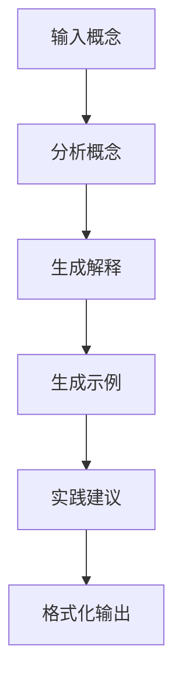

# 📚 概念深度讲解器

一个基于 PocketFlow 的智能学习助手，帮助你深入理解编程概念。

## 功能特点

✅ **多角度解释**：从"是什么、为什么、怎么用"三个维度讲解概念
✅ **生动类比**：用生活中的例子帮助理解抽象概念
✅ **代码示例**：提供实际代码展示概念应用
✅ **实践建议**：给出学习路径、练习想法和推荐资源
✅ **避坑指南**：指出常见误区，少走弯路

## 快速开始

### 1. 安装依赖

```bash
cd /Users/80892291/WorkSpace/IDEA/pocketflow/PocketFlow/my-skills/learning-explainer
pip install -r requirements.txt
```

### 2. 配置 LLM

编辑 `utils/call_llm.py`，根据你使用的 LLM（OpenAI/Claude/Gemini）取消注释相应代码，并设置 API Key：

```bash
# OpenAI
export OPENAI_API_KEY="your-key-here"

# 或 Anthropic Claude
export ANTHROPIC_API_KEY="your-key-here"

# 或 Google Gemini
export GEMINI_API_KEY="your-key-here"
```

### 3. 运行

**交互模式**：
```bash
python main.py
```

**命令行模式**：
```bash
python main.py "Python装饰器"
python main.py "闭包"
python main.py "依赖注入"
```

## 使用示例

```bash
$ python main.py "Python装饰器"

🔍 正在深入讲解：Python装饰器
------------------------------------------------------------
✓ 概念分析完成：编程概念 | 中级
✓ 多角度解释生成完成
✓ 类比和示例生成完成
✓ 实践建议生成完成

============================================================
# 📚 概念深度讲解：Python装饰器

## 📊 概念分析
- **类型**：编程概念
- **难度**：中级
- **领域**：Python

## 💡 多角度理解

### 🔍 是什么？（What）
装饰器是一种设计模式，允许你在不修改原函数代码的情况下，
给函数添加新功能...

[后续内容]
============================================================

💾 是否保存到文件？(y/n): y
✅ 已保存到：Python装饰器_讲解.md
```

## 适用场景

- 🎯 学习新的编程概念时快速理解
- 🎯 复习已学知识，查漏补缺
- 🎯 准备面试，深入理解核心概念
- 🎯 教学辅助，生成教学素材

## 工作原理

基于 PocketFlow 的 **Workflow（工作流）** 设计模式：



每个节点负责一个专门的任务，通过 shared store 传递数据。

## 目录结构

```
learning-explainer/
├── main.py              # 主程序入口
├── nodes.py             # 节点定义（5个节点）
├── flow.py              # 流程定义
├── utils/
│   └── call_llm.py      # LLM 调用工具
├── docs/
│   └── design.md        # 详细设计文档
├── requirements.txt     # 依赖列表
└── README.md            # 本文件
```

## 扩展建议

你可以轻松扩展这个技能：

1. **添加更多节点**：
   - 生成思维导图节点
   - 生成记忆卡片节点
   - 生成测试题节点

2. **添加条件分支**：
   - 根据难度级别调整讲解深度
   - 根据概念类型使用不同模板

3. **添加批处理**：
   - 一次讲解多个相关概念
   - 生成概念对比表

## 许可

MIT License
